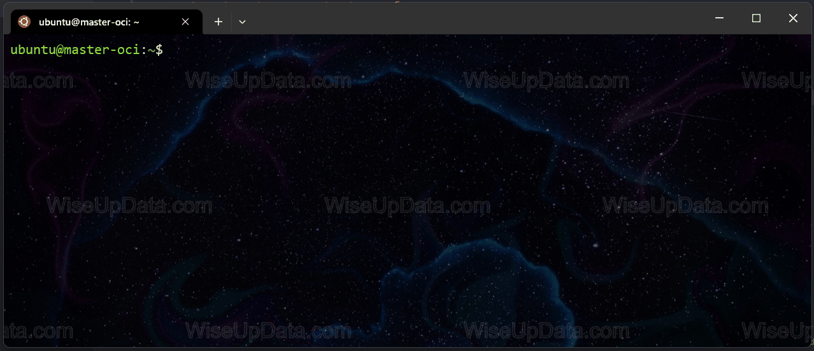

<a href="https://github.com/wiseupdata/wiseupdata">
     
</a> 
<a href="https://github.com/wiseupdata/wiseupdata">
  
</a>
<a href="https://github.com/wiseupdata/wiseupdata">
  
</a>
<a href="https://github.com/wiseupdata/wiseupdata">
  
</a>

 


---

<a name="readme-top"></a>

<h1>
<br>
<br>


# VMs


<details>
<summary>
    Install GUI RDP, remote desktop in one VM 
</summary>

### test

> hi

```
hello
```

### Let's update the system the Chrome 🚀️


```
sudo apt update
sudo apt upgrade
```



<br>
</details>

<br>


# References

1. [Wise Up Data](https://github.com/wiseupdata)

---

<br>
<br>


---

#### Maintainer 🤗 👨‍💻

Sivio Liborio

📧 silvio.liborio@wiseupdata.com

<a href="https://www.linkedin.com/in/silvio-de-melo-liborio">silvio-de-melo-liborio 
</a>
